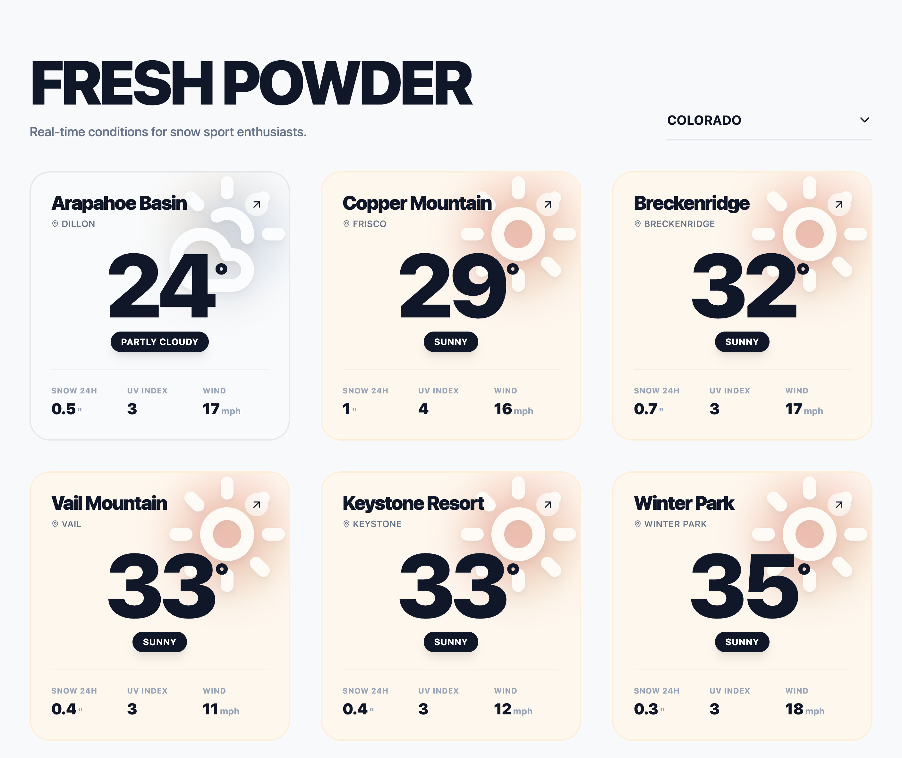
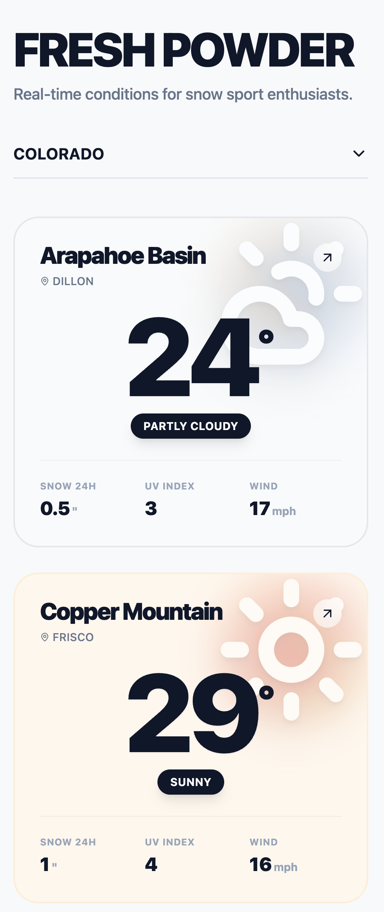

# Fresh Powder

A modern React application displaying weather conditions for Colorado ski resorts.

## Preview

### Desktop View


### Mobile View


## Features

- 🎿 Real-time weather data for Colorado resorts
- 🎨 Modern, minimalist UI design
- 🔍 Search functionality to find resorts
- 📊 Comprehensive weather metrics (temperature, snow, wind, UX index)
- 🌈 Dynamic theming based on weather conditions

## Getting Started

### Prerequisites

- Node.js (v18 or higher)
- npm or yarn

### Installation

1. Install dependencies:
```bash
npm install
```

2. Start the development server:
```bash
npm run dev
```

3. Open your browser and navigate to the URL shown in the terminal (typically `http://localhost:5173`)

### Build for Production

```bash
npm run build
```

The built files will be in the `dist` directory.

## Tech Stack

- **React 18** - UI framework
- **TypeScript** - Type safety
- **Vite** - Build tool and dev server
- **Tailwind CSS** - Styling
- **Lucide React** - Icons

## Project Structure

```
fresh-powder/
├── components/       # React components
│   ├── ResortCard.tsx
│   └── WeatherIcon.tsx
├── data/            # Mock data
│   └── mockResorts.ts
├── pages/           # Page components
│   └── ResortWeatherApp.tsx
├── types/           # TypeScript type definitions
│   └── resort.ts
├── App.tsx          # Root component
├── index.tsx        # Entry point
└── index.html       # HTML template
```

## License

© 2026 Fresh Powder

